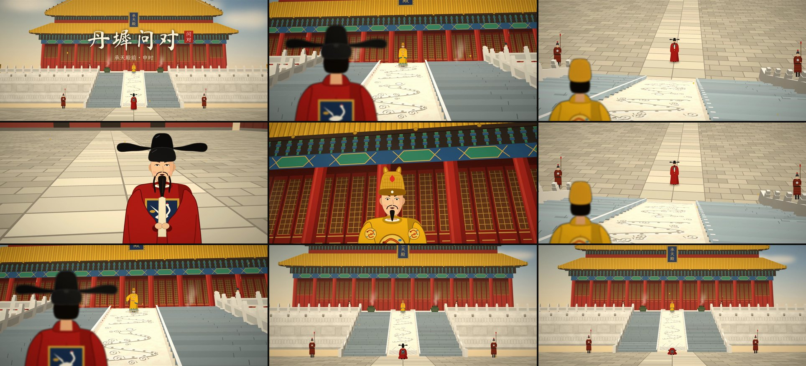
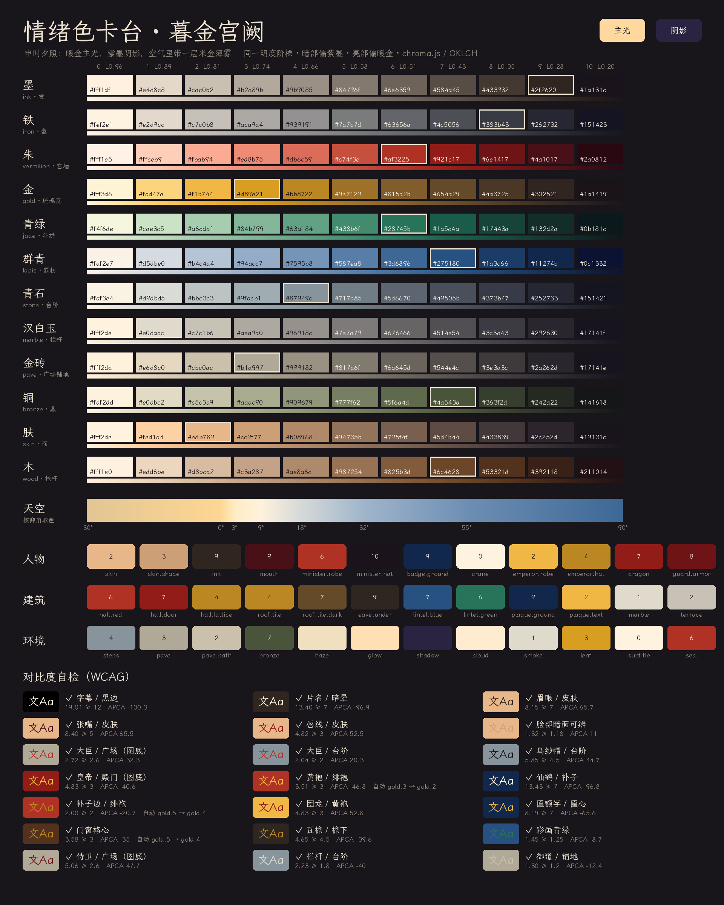
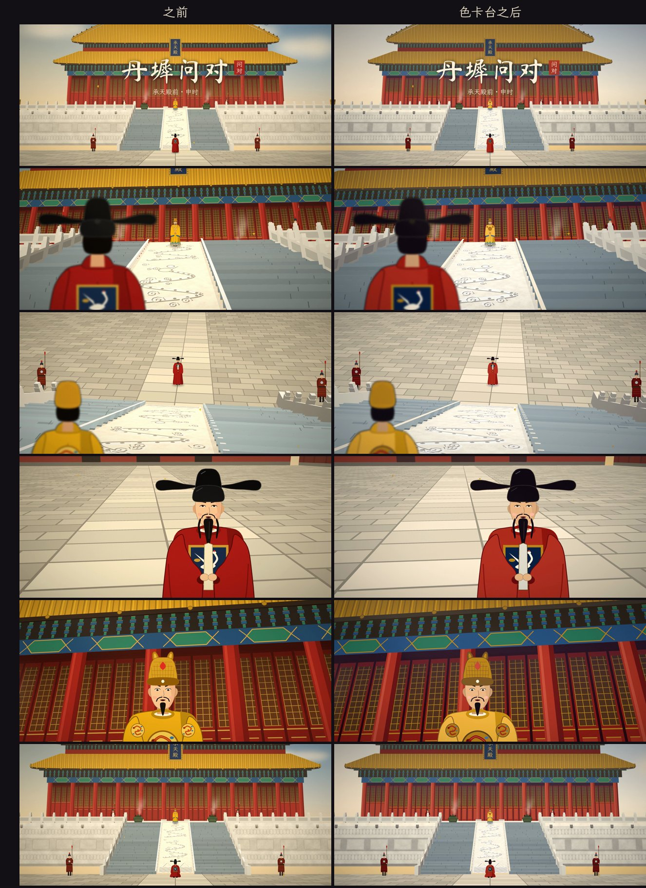
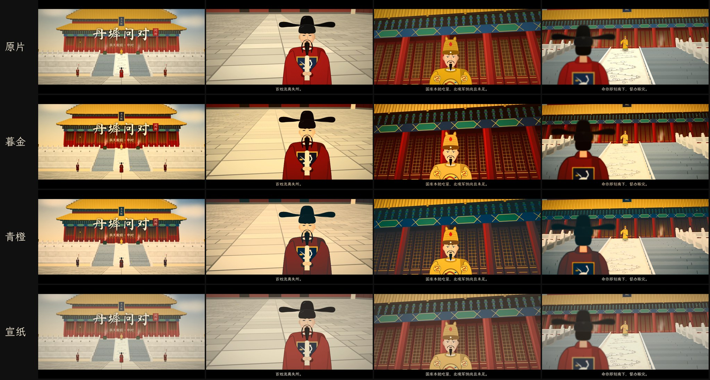

# LLM2Video：用大模型“写”出一段视频

示例成片：[`output/danchi_wendui.mp4`](output/danchi_wendui.mp4)，《丹墀问对》，约 56 秒，1920×1080，带中文配音、配乐和字幕。

> 一位户部侍郎立在承天殿前的青石台阶下，仰视阶上的皇帝，君臣几问几答，请旨开仓赈灾。



## Claude 能不能直接生成视频？

**不能直接“吐”出视频文件。** Claude 是语言模型，它能读图，但输出只有文字和代码。它不像 Sora、Veo、可灵、即梦、海螺那样是视频生成模型。

不过它可以通过两条路线“做”出视频。

| 路线 | 做法 | 优点 | 局限 |
| --- | --- | --- | --- |
| **A. 代码渲染（本仓库）** | Claude 写剧本和分镜，再写渲染程序：3D 场景 + 2D 角色 + 离线 TTS + 程序化配乐，最后用 ffmpeg 合成 MP4 | 全自动、可复现、零成本、可随意改台词和镜头 | 画风是扁平插画，不是真人实拍 |
| **B. 调用 AI 视频模型** | Claude 写剧本、分镜和每个镜头的提示词，你把它们交给视频模型生成，或者让 Claude 写脚本调它们的 API，再配音、对口型、剪辑 | 可以是写实电影质感 | 需要对应平台的账号或 API Key，人物一致性和对口型要多次抽卡 |

## 本仓库的流程（路线 A）

```
剧本 JSON（LLM 写）
   │  screenplays/danchi_wendui.json：角色、音色、镜头、台词、动作
   ▼
① 语音合成 llm2video/tts.py
   │  sherpa-onnx + Kokoro 离线中文 TTS，皇帝用低沉男声，大臣用年轻男声
   │  台词按标点切成字幕块，逐块合成，得到每句的精确时间轴
   ▼
② 声音设计 llm2video/audio.py
   │  Karplus-Strong 拨弦模拟古琴五声音阶、铜钟、堂鼓、风声、殿堂混响
   │  人声出现时自动压低音乐（ducking），并从人声包络生成每帧的口型开合
   ▼
③ 场景 llm2video/palace.py + cam3d.py
   │  用真实 3D 坐标搭建：22 级青石台阶、中间雕龙御路、汉白玉栏杆、须弥座、
   │  重檐庑殿顶大殿（斗拱、彩画、匾额“承天殿”）、廊庑、宫门、铜鼎、侍卫
   │  针孔相机透视投影 + 画家算法遮挡 + 光照 + 空气透视
   ▼
④ 角色 llm2video/figures.py
   │  大臣：乌纱帽、绯袍、仙鹤补子、笏板、三绺长髯
   │  皇帝：翼善冠、明黄龙袍、团龙纹、江崖海水纹
   │  支持正面/背面、口型、眨眼、躬身、抬手、跪拜叩首
   ▼
⑤ 导演 llm2video/director.py
   │  机位：大全景、大臣过肩仰拍、皇帝过肩俯拍、两人近景
   │  推拉镜头、香烟缭绕、落叶、飞鸟、云、光束、调色、暗角、胶片颗粒、宽银幕遮幅
   ▼
⑥ ffmpeg 编码 H.264 + AAC → output/*.mp4
```

### 运行

```bash
pip install -r requirements.txt
python make_video.py screenplays/danchi_wendui.json -o output/danchi_wendui.mp4
# 只看几帧静帧（调镜头时用）
python make_video.py screenplays/danchi_wendui.json --preview 100,330,660
```

第一次运行会自动下载字体（霞鹜文楷、马善政毛笔楷书）和 Kokoro 语音模型（约 350 MB），都放在 `assets/`。系统里没有 ffmpeg 时，会使用 `imageio-ffmpeg` 自带的版本。

### 改剧本

把台词、动作和镜头改成你想要的就行，也可以直接让 Claude 按下面的格式写一个新的：

```json
{"camera": "low", "speaker": "emperor", "line": "阶下何人？所奏何事？"}
```

- `camera`：`wide` 大全景 · `low` 大臣过肩仰拍皇帝 · `high` 皇帝过肩俯拍大臣 · `emperor_close` · `minister_close` · `wide_end`
- `action`：`bow` 躬身 · `gesture` 皇帝抬手 · `kowtow` 跪下叩首
- `pre` / `tail`：说话前后的停顿（秒）
- `cue`：`bell` 钟声 · `drum` 鼓声
- `characters.*.voice`：Kokoro 音色编号。49 = zm_yunjian（低沉），50 = zm_yunxi（年轻），52 = zm_yunyang

## 想要写实电影风格？（路线 B 提示词）

下面这组分镜提示词可以直接用在可灵、即梦、海螺、Vidu、Veo、Sora 等平台。建议先用文生图固定人物形象，再用“图生视频”保持人物一致。

1. **大全景（5s）**：明代紫禁城式宫殿，重檐庑殿顶金黄琉璃瓦，汉白玉须弥座，一道长长的青石台阶中间是雕龙御路。一位身穿绯红官袍、头戴乌纱帽的大臣背影立于台阶之下，手持象牙笏板；阶顶身穿明黄龙袍的皇帝负手而立。黄昏侧逆光，香炉青烟，电影感，35mm，缓慢推镜。
2. **仰拍过肩（4s）**：从大臣右肩后方低机位仰拍，前景是虚化的乌纱帽和绯袍，焦点在台阶顶端的皇帝，皇帝俯视开口说话，逆光轮廓光，庄严压迫感。
3. **俯拍过肩（4s）**：从皇帝左肩后方高机位俯拍，前景是虚化的明黄龙袍和翼善冠，远处台阶下的大臣躬身行礼、抬头回话，青石台阶纵深透视。
4. **大臣近景（7s）**：中年文官，三绺长髯，神情恳切，双手持笏抬头仰望，边说边微微躬身，背景是空旷的宫殿广场，浅景深。
5. **皇帝近景（7s）**：低角度，皇帝眉头微皱，沉吟后开口，背景是朱红门窗和金色斗拱。
6. **结尾大全景（6s）**：大臣跪下叩首谢恩，镜头缓缓拉远，夕阳下的宫殿。

台词和配音可以沿用本仓库的剧本和 TTS 输出（`build/audio.wav`），再用平台的对口型功能或剪映合成。

## 情绪色卡台（Chroma.js 配色）

画面里的每一个颜色都从同一张色卡台里取：`grade/make_palette.mjs` 用 [Chroma.js](https://gka.github.io/chroma.js/) 生成，结果写进 `llm2video/palette.json`，渲染器只认这里的颜色。





- **一个情绪定调。** 「暮金宫阙」：暖金主光、紫墨阴影。
- **统一的明度阶梯。** 12 个色族（朱、金、青绿、群青、青石、汉白玉、金砖、肤……）都拉成 11 级色阶，第 k 级在所有色族里感知明度相同（OKLCH L 0.96 → 0.20），不同颜色并排时明暗节奏一致。
- **色相随明度漂移。** 越暗越偏向阴影紫墨，越亮越偏向主光暖金，所有颜色像被同一束光照着，这是整体色调不分裂的关键。超出 sRGB 色域的颜色只收饱和度、不改明度。
- **角色而不是色值。** 代码里写的是 `pal("minister.robe")`、`pal("roof.tile")` 这样的语义角色，角色再指向某个色族的某一级。
- **顺着色阶打光。** 受光、背光、远处的薄雾都是沿着该颜色自己的 101 级细分色阶滑动（OKLab 里计算），不再按 RGB 乘系数，所以阴影不会变脏、变灰。
- **对比度自动过检。** 必须分得清的组合（字幕/黑边、眉眼/皮肤、补子仙鹤、匾额字、人物/背景……）用 WCAG 对比度检查，同时给出 APCA 值。不达标时，自动把前景角色沿色阶往更亮或更暗挪，直到通过，并在报告里写明挪了几级。
- **天空也来自色卡。** 天空按仰角，从地平线的暖金经米白过渡到群青。

改配色只需改 `MOOD`、`FAMILIES` 或 `ROLES`，然后：

```bash
cd grade && npm install && node make_palette.mjs   # 生成 palette.json，打印色阶和对比度自检
cd .. && python -m llm2video.board docs/palette.png   # 重新画色卡台
python make_video.py screenplays/danchi_wendui.json  # 重新出片
```

### 二十版色卡台

- [调研：国际规范、流行色、2026 产品配色](docs/color_research.md)
- 20 套情绪预设：`grade/presets.mjs`；生成好的色卡：`grade/palettes/01.json` … `20.json`
- [总览](docs/versions/overview.jpg) · 详细对比 [1–5](docs/versions/sheet_1.jpg) · [6–10](docs/versions/sheet_2.jpg) · [11–15](docs/versions/sheet_3.jpg) · [16–20](docs/versions/sheet_4.jpg)

```bash
node grade/make_palette.mjs grade/palettes/07.json --preset=07          # 生成某一版
LLM2VIDEO_PALETTE=grade/palettes/07.json python make_video.py screenplays/danchi_wendui.json   # 用这一版出片
```

## 后期 LUT 调色（Chroma.js）

`grade/make_lut.mjs` 用 [Chroma.js](https://gka.github.io/chroma.js/) 在 OKLab/OKLCH 感知色彩空间里计算调色，导出 3D LUT（`.cube`）。具体做法：
- 对明度做 S 曲线；
- 按色相调整饱和度：红色和金色加浓，天蓝收一点；
- 按亮度做暗部、亮部的分离色调；
- 纯黑（遮幅黑边）保持不变。

LUT 通用，ffmpeg、达芬奇、剪映都能直接加载。

| 风格 | 说明 |
| --- | --- |
| `dusk` 暮金 | 暗部压暖褐，高光鎏金，宫墙和琉璃瓦更浓 |
| `teal_orange` 青橙 | 电影常见的青橙对比，暗部偏青，亮部偏橙 |
| `xuanzhi` 宣纸 | 降饱和、黑位抬成墨色、高光米黄，像旧画卷 |



```bash
cd grade && npm install && npm run luts          # 生成 luts/*.cube
ffmpeg -i output/danchi_wendui.mp4 -vf lut3d=grade/luts/dusk.cube -c:a copy output/graded/dusk.mp4
```
